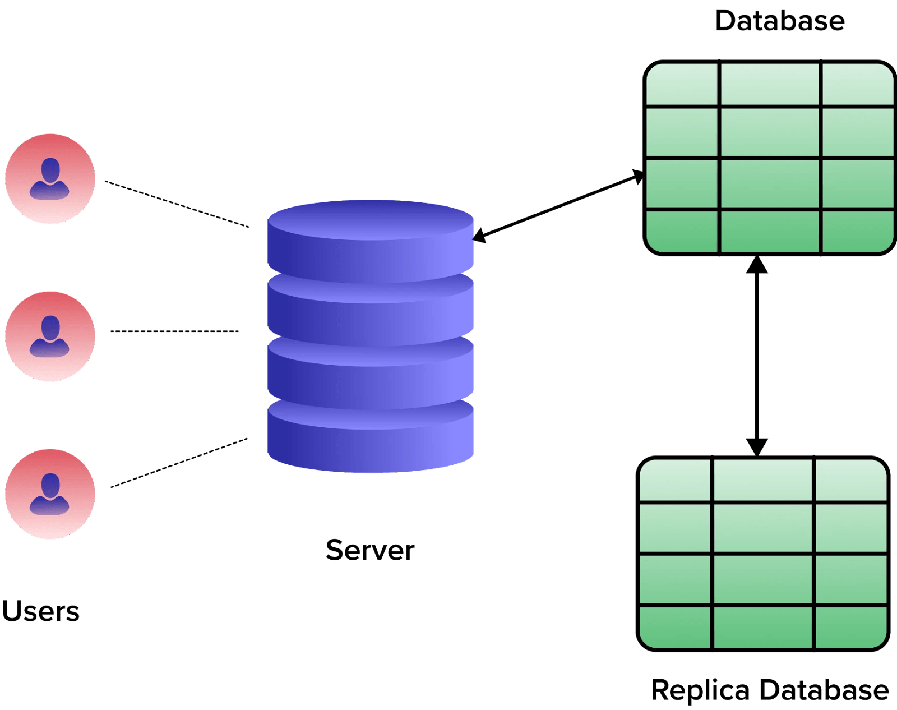
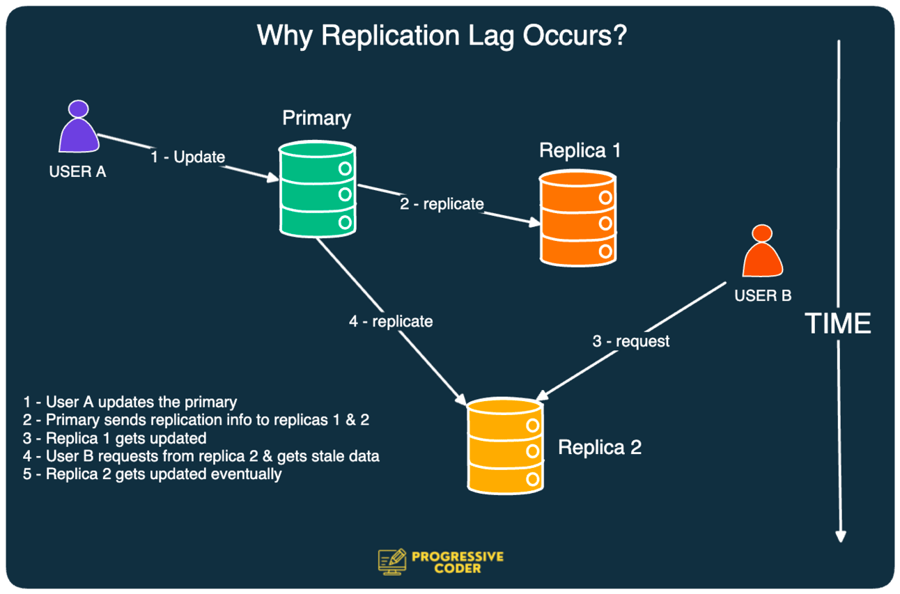
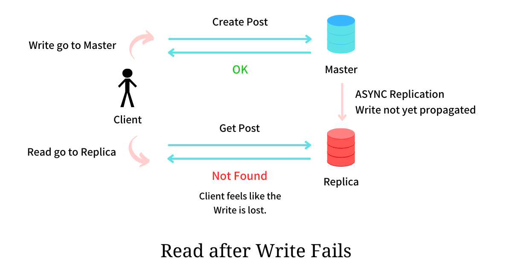
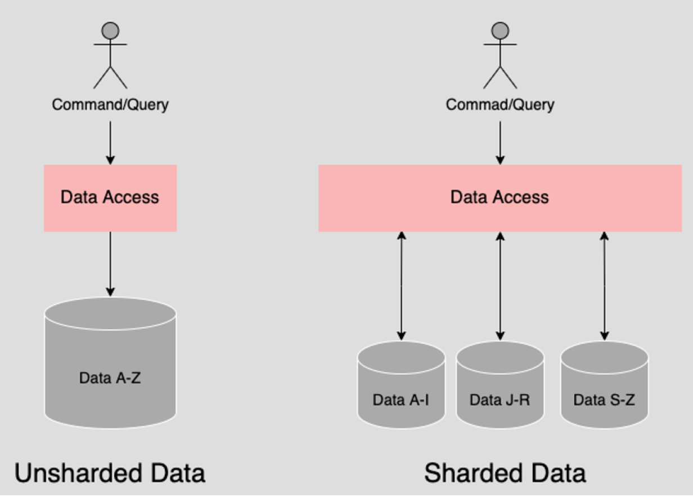
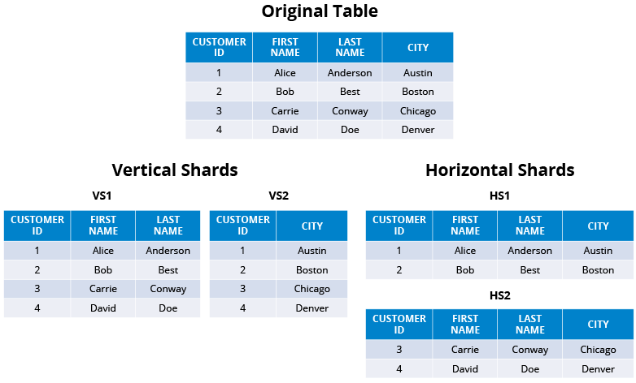

# Database Replication

Database replication is the process of copying and maintaining database objects, data, or entire databases across multiple systems, ensuring consistency and availability. It's a critical aspect of data management, providing redundancy and fault tolerance, as well as enabling load balancing and disaster recovery.



**<i>"Copyright: Image belongs to [respective-owner](https://estuary.dev/data-replication-strategies/). Used here with permission or under fair use."</i>**

 Here's how it typically works:

### Types of Replication:

1. **Full Replication**:
   - Entire database is replicated to one or more secondary systems.
   - Provides complete redundancy and fault tolerance.
   - Suitable for scenarios where the entire dataset needs to be available at all replicas.

2. **Partial Replication**:
   - Only a subset of the database is replicated to secondary systems.
   - Useful when certain parts of the database are accessed more frequently or require higher availability.

3. **Master-Slave Replication**:
   - One primary database (master) replicates data to one or more secondary databases (slaves).
   - Read operations can be distributed among slaves, reducing the load on the master.
   - Slaves are typically used for read-only operations, while the master handles write operations.

4. **Master-Master Replication**:
   - Two or more databases act as both master and slave simultaneously.
   - Enables bidirectional data replication between multiple databases.
   - Increases availability and scalability by distributing read and write operations across multiple nodes.

### Benefits:

- **Fault Tolerance**: If one database fails, operations can continue uninterrupted using the replicated copy.
- **Scalability**: Distributing read operations across replicas can improve performance and scalability.
- **Load Balancing**: Distributes read and write operations among multiple replicas, balancing the workload.
- **Disaster Recovery**: Provides backup copies of data that can be used for disaster recovery in case of data loss or corruption.
- **Geographical Distribution**: Replicating data across different geographical locations can improve performance and reduce latency for users in different regions.

### Challenges:

- **Data Consistency**: Ensuring that replicated data remains consistent across all copies can be challenging, especially in distributed environments with concurrent updates.
- **Latency**: Replicating data across long distances can introduce latency, impacting the freshness of replicated data.
- **Conflict Resolution**: When multiple replicas are updated simultaneously, conflicts may arise that need to be resolved to maintain data integrity.
- **Resource Overhead**: Maintaining replicas requires additional storage, network bandwidth, and processing resources.
- **[replication lag](#replication-lag)**: refers to the delay between the time a change is made to the primary database and the time it is reflected in the replicated databases .

Overall, database replication is a crucial technique for ensuring data availability, reliability, and scalability in modern distributed database systems.

# Replication lag

 replication lag is a significant challenge in database replication systems. It refers to the delay between the time a change is made to the primary database and the time it is reflected in the replicated databases. Several factors contribute to replication lag:

 

 **<i>"Copyright: Image belongs to [respective-owner](https://newsletter.systemdesigncodex.com/p/why-replication-lag-occurs-in-databases). Used here with permission or under fair use."</i>**

1. **Network Latency**: The time it takes for data to travel between the primary and replica databases over the network. Longer distances or congested networks can increase latency.

2. **Volume of Changes**: If there's a high volume of write operations on the primary database, replication systems may struggle to keep up, leading to replication lag.

3. **Replication Method**: Different replication methods have different levels of latency. Asynchronous replication, where changes are propagated to replicas with a delay, typically has higher replication lag compared to synchronous replication.

4. **Resource Constraints**: Limited CPU, memory, or disk I/O resources on the replica databases can slow down the replication process.

5. **Conflict Resolution**: In multi-master replication setups, conflicts may occur when two or more replicas are updated simultaneously. Resolving these conflicts can introduce additional delays.

6. **Schema Complexity**: Replicating changes to complex data structures or large tables can take longer, especially if the replication system needs to perform additional processing or transformation.

### Mitigating Replication Lag:

1. **Optimize Network Infrastructure**: Minimize network latency by using high-speed connections, optimizing routing, and reducing network congestion.

2. **Replication Configuration**: Fine-tune replication parameters such as batch sizes, commit intervals, and buffer sizes to optimize performance.

3. **Monitoring and Alerting**: Implement monitoring systems to track replication lag and alert administrators when it exceeds predefined thresholds.

4. **Load Balancing**: Distribute read operations evenly across replica databases to reduce the load on individual replicas and minimize replication lag.

5. **Database Tuning**: Optimize database performance by indexing frequently accessed columns, optimizing queries, and periodically vacuuming or reorganizing tables.

6. **Prioritize Critical Data**: Replicate critical data with higher priority to ensure that it is replicated promptly, even during periods of high load.

# How Replication Lag is calculated.

The replication lag can be calculated by determining the time delay between the timestamp of a change made on the primary database and the timestamp when the same change is applied on the replica database. The mathematical formula for calculating replication lag in this scenario would be:

Replication Lag = Timestamp on Replica - Timestamp on Primary

Where:
- **Timestamp on Replica**: The timestamp when the change is applied on the replica database.
- **Timestamp on Primary**: The timestamp when the same change is made on the primary database.

This calculation gives you the time difference between the application of the change on the primary database and its application on the replica database, indicating the replication lag. The result is typically expressed in units of time, such as seconds, milliseconds, or microseconds.

If the replication lag is greater than the time difference calculated between the timestamps on the replica and primary databases, or if it's smaller, it implies different scenarios:

1. **Replication Lag Greater than Time Difference**:
   - This situation indicates that the replication process is experiencing delays beyond the time difference accounted for by the timestamps. There could be various reasons for this, such as network congestion, resource limitations on the replica database, or inefficiencies in the replication mechanism.
   - It suggests that the replica database is falling behind the primary database in terms of data synchronization, potentially leading to data inconsistency or staleness in the replica.

2. **Replication Lag Smaller than Time Difference**:
   - If the replication lag is consistently smaller than the time difference calculated, it suggests efficient replication performance. In this case, the replica database is keeping up with or even surpassing the primary database in terms of data synchronization.
   - However, occasional occurrences of smaller replication lag might not be a cause for concern, as replication systems can exhibit variations in performance due to factors like network fluctuations or temporary resource spikes.

It's essential to maintain replication lag within acceptable thresholds to ensure timely and consistent data replication across the system.

# How to solve Database consistency issues 

- The manner in which these issues are solved is called **consistency models** or **consistency algorithms**

one of these models or algorithsm is:
 1) Read after write consistency / Synchronous replication
 2) Asynchronous Replication

    
     **<i>"Copyright: Image belongs to [respective-owner](https://www.linkedin.com/pulse/asynchronous-vs-synchronous-replication-k-satheeskumar-ccie-r-s-38651). Used here with permission or under fair use."</i>**

 3) Hybrid Replication ( Synchronous + Asynchronous )

 Let's delve into each of these consistency models/algorithms to understand how they address database consistency issues:

### 1) Read After Write Consistency / Synchronous Replication:

- **Concept**: In this model, when a write operation is performed on the primary database, subsequent read operations from any replica database are guaranteed to return the most recent version of the data. This ensures that any data written to the primary database is immediately available for reads from all replicas.
<br /><br />

**<i>"Copyright: Image belongs to [respective-owner](https://arpitbhayani.me/blogs/read-your-write-consistency/). Used here with permission or under fair use."</i>**

- **Implementation**: Achieved through synchronous replication, where each write operation on the primary database is replicated to all replica databases before the operation is acknowledged as committed. This ensures that all replicas have an up-to-date copy of the data at all times.
- **Benefits**: Provides strong consistency guarantees by ensuring that reads always reflect the latest state of the data. Useful for applications that require real-time data synchronization and strict consistency requirements.
- **Challenges**: May introduce higher latency and performance overhead due to the need to wait for replication acknowledgments before completing write operations. Requires a robust network infrastructure to handle synchronous replication traffic effectively.

### 2) Asynchronous Replication:
- **Concept**: In asynchronous replication, write operations on the primary database are replicated to replica databases with some delay, and replicas may temporarily lag behind the primary database. However, read operations from replicas do not necessarily reflect the most recent state of the data.
- **Implementation**: Write operations are acknowledged as committed on the primary database before being replicated to the replica databases asynchronously. This allows the primary database to continue processing transactions without waiting for replication to complete.
- **Benefits**: Reduces latency and performance overhead on the primary database by decoupling write and replication operations. Can be suitable for applications where eventual consistency is acceptable, and strict consistency requirements are not critical.
- **Challenges**: May lead to data inconsistency issues if replicas lag significantly behind the primary database. Requires careful monitoring and conflict resolution mechanisms to ensure eventual consistency across replicas.

### 3) Hybrid Replication (Synchronous + Asynchronous):
- **Concept**: Hybrid replication combines synchronous and asynchronous replication techniques to achieve a balance between strong consistency guarantees and performance.
- **Implementation**: Critical or high-priority data can be replicated synchronously to ensure immediate consistency, while less critical data can be replicated asynchronously to minimize performance overhead.
- **Benefits**: Offers flexibility to tailor replication strategies based on the specific requirements of different types of data or applications. Allows organizations to achieve a balance between consistency, availability, and performance.
- **Challenges**: Requires careful planning and configuration to determine which data should be replicated synchronously and which can be replicated asynchronously. May introduce complexity in managing and maintaining hybrid replication setups.

NB:

**Synchronous replication** prioritizes data `consistency`, ensuring that all replicas have the same data at all times, which is crucial for applications requiring strict consistency guarantees. However, it may introduce <b>latency and performance overhead due to the need to wait for replication acknowledgments</b>.

On the other hand, **asynchronous replication** prioritizes `performance` by allowing primary database operations to proceed without waiting for replication to complete. This reduces latency and overhead on the primary database, making it suitable for applications where eventual consistency is acceptable and strict consistency requirements can be relaxed.

# Database Snapshots

Database snapshots are a point-in-time copy of a database's data at a specific moment. They provide a consistent view of the database at the time the snapshot was taken, allowing users to query and analyze data without interfering with ongoing transactions or changes to the database.

### Key Aspects of Database Snapshots:

1. **Consistency**: Database snapshots provide a consistent and immutable view of the database as it existed at the time the snapshot was created. This ensures that queries run against the snapshot return accurate and reliable results.

2. **Point-in-Time Recovery**: Snapshots enable point-in-time recovery, allowing administrators to restore the database to a specific state by reverting to a snapshot taken before a data corruption or loss occurred.

3. **Data Analysis**: Database snapshots are commonly used for data analysis, reporting, and testing purposes. Analysts can run complex queries against the snapshot without impacting the live database or risking unintended changes to production data.

4. **Space Efficiency**: Snapshots typically utilize copy-on-write or similar techniques to minimize storage overhead. Instead of duplicating all data, snapshots store only the changes made to the database after the snapshot was taken.

### How Database Snapshots Work:

- **Creation**: Database snapshots are created by capturing the current state of the database's data files, transaction logs, or other relevant components. Depending on the database system, snapshots may be created using built-in commands or external tools.

- **Usage**: Once created, users can query the snapshot using standard database querying tools or interfaces. The snapshot provides a read-only view of the database, allowing users to retrieve and analyze data without modifying the original database.

- **Retention**: Administrators can choose to retain snapshots for a specific period or until they are no longer needed for analysis or recovery purposes. Snapshots can be deleted or archived once they are no longer required.

### Benefits of Database Snapshots:

- **Data Protection**: Snapshots provide a reliable backup mechanism for protecting against data loss or corruption, enabling quick recovery to a known good state.

- **Data Analysis**: Analysts and developers can use snapshots to perform ad-hoc queries, testing, and experimentation without affecting production databases.

- **Performance**: By offloading read-heavy workloads to snapshots, organizations can improve the performance and responsiveness of production databases.

- **Data Privacy**: Snapshots can be used to create anonymized or masked copies of production data for use in development, testing, or training environments, ensuring data privacy and compliance with regulations.

# Database replication vs database snapshots

Database replication and database snapshots are both techniques used in database management, but they serve different purposes and have distinct characteristics. Let's compare them:

### Database Replication:

1. **Purpose**:
   - **Real-time Data Distribution**: Replication is used to ensure that data changes made to a primary database are replicated to one or more replica databases in real-time or near real-time.
   - **High Availability and Fault Tolerance**: Replicas can serve as failover targets, providing redundancy and ensuring continuous availability of data even in the event of primary database failures.

2. **Consistency**:
   - **Consistency Guarantees**: Depending on the replication method (synchronous or asynchronous), replicas may provide strong consistency guarantees (synchronous) or eventual consistency (asynchronous).

3. **Performance**:
   - **Impact on Performance**: Replication can introduce performance overhead on the primary database due to the need to replicate changes to replicas and maintain consistency across the distributed system.

4. **Use Cases**:
   - **Load Balancing**: Distributing read operations across replicas can improve overall database performance and scalability.
   - **Disaster Recovery**: Replicas can be used for failover and disaster recovery, ensuring data availability and continuity of operations.

### Database Snapshots:

1. **Purpose**:
   - **Point-in-Time Analysis**: Snapshots provide a consistent view of the database at a specific point in time, allowing users to query and analyze historical data without affecting the live database.
   - **Backup and Recovery**: Snapshots can be used for backup purposes and point-in-time recovery, enabling administrators to restore the database to a known good state.

2. **Consistency**:
   - **Immutable Data**: Snapshots provide an immutable view of the database as it existed at the time the snapshot was taken, ensuring consistency for analysis and recovery purposes.

3. **Performance**:
   - **Low Impact**: Snapshots typically have minimal impact on database performance since they are read-only copies of the database's data at a specific point in time.

4. **Use Cases**:
   - **Data Analysis**: Analysts and developers can use snapshots for ad-hoc querying, reporting, and testing without affecting production databases.
   - **Point-in-Time Recovery**: Snapshots enable administrators to restore the database to a previous state in case of data corruption or loss.

### Comparison:

- **Purpose**: Replication focuses on real-time data distribution and high availability, while snapshots are primarily used for analysis, backup, and recovery.
- **Consistency**: Replicas in database replication provide varying levels of consistency guarantees, while snapshots provide an immutable and consistent view of the database at a specific point in time.
- **Performance**: Replication can impact database performance due to the overhead of maintaining consistency across replicas, while snapshots have minimal performance impact since they are read-only copies.
- **Use Cases**: Replication is ideal for scenarios requiring continuous data availability and fault tolerance, while snapshots are suitable for data analysis, backup, and point-in-time recovery.


# Database Sharding

Database sharding is a technique used to partition a large database into smaller, more manageable pieces, called shards. Each shard is a separate database that contains a subset of the data. This approach can improve performance, scalability, and availability of the database system. Here’s a detailed overview:


https://www.redhat.com/architect/pros-and-cons-sharding

### Key Concepts

1. **Shard**: An individual partition or segment of the database. Each shard holds its own data and operates independently.
2. **Shard Key**: A specific key or set of keys used to determine how data is distributed across shards.
3. **Horizontal Partitioning**: Data is divided across multiple databases (shards), each storing a subset of the rows.
4. **Vertical Partitioning**: Data is divided by columns, with different shards containing different columns of the same table. This is less common and usually used in conjunction with horizontal partitioning.


https://hazelcast.com/glossary/sharding/
### Benefits of Sharding

1. **Scalability**: Sharding allows a database to handle more data and more requests by distributing the load across multiple servers.
2. **Performance**: By distributing the data, sharding can reduce the load on any single database server, thus improving query performance.
3. **Availability and Fault Tolerance**: If one shard goes down, others can continue to function, improving the overall availability of the system.
4. **Cost Efficiency**: Instead of scaling up a single server, sharding allows the use of multiple lower-cost servers.

### Challenges of Sharding

1. **Complexity**: Sharding adds complexity to the database architecture, requiring careful planning and management.
2. **Data Distribution**: Ensuring an even distribution of data across shards can be challenging. Uneven distribution can lead to hotspots where some shards handle more load than others.
3. **Cross-Shard Joins and Transactions**: Queries that require data from multiple shards can be complex and less efficient.
4. **Rebalancing**: Adding or removing shards involves rebalancing data, which can be complex and time-consuming.

### Sharding Strategies

1. **Range-Based Sharding**: Data is divided based on ranges of the shard key. For example, users with IDs 1-1000 go to one shard, and users with IDs 1001-2000 go to another.
2. **Hash-Based Sharding**: A hash function is applied to the shard key to determine the shard. This usually provides a more even distribution of data.
3. **Directory-Based Sharding**: A lookup table (directory) is used to map each key to a specific shard. This provides flexibility but adds overhead due to the lookup process.


### Implementation Steps

1. **Define Shard Key**: Choose an appropriate shard key that ensures an even distribution of data.
2. **Set Up Shards**: Create multiple databases or servers to act as shards.
3. **Data Distribution**: Implement logic to distribute data across shards based on the shard key.
4. **Routing Layer**: Develop or use an existing routing layer to direct queries to the appropriate shard.
5. **Data Management**: Implement mechanisms for data migration, backup, and rebalancing.

### Tools and Technologies

Several database management systems and tools support sharding, either natively or through extensions:
- **MySQL**: Tools like Vitess provide sharding capabilities.
- **MongoDB**: Has built-in support for sharding.
- **Cassandra**: Uses a distributed architecture that inherently supports sharding.
- **PostgreSQL**: Extensions like Citus enable sharding.

### Conclusion

Database sharding is a powerful technique for scaling databases and improving performance. However, it introduces complexity and requires careful planning and management. By understanding the benefits and challenges, and by choosing the right sharding strategy and tools, organizations can effectively manage large and growing datasets.

<!-- # sharding strategies
   1) algorithmic sharding
   2) Dynamic sharding -->

###  Sharding Strategies in details

1) #### Key based sharding

   **Key-based sharding**, also known as `hash-based sharding`, is a technique where the shard in which a piece of data resides is determined by applying a hash function to a key. This method ensures an even distribution of data across shards, reducing the likelihood of hotspots and ensuring predictable query performance.


https://www.digitalocean.com/community/tutorials/understanding-database-sharding

#### How It Works

1. **Select a Shard Key**: Choose a key that uniquely identifies each record. Common examples include user IDs, product IDs, or order IDs. **SHARD KEYS ARE NOT PRIMARILY PRIMARY KEYS. PRIMARY KEY CAN ALSO BE A SHARD KEY BUT THATS OPTIONAL **
2. **Apply a Hash Function**: Use a hash function to generate a hash value from the shard key. **HASH FUNCTION WILL ALWAYS RETURN THE SAME VALUE FOR A KEY. EG, IF PRODUCT_ID=1 IS PASSED TO THE HASH FUNCTION NOW AND RETURNS K, EVEN 100 WEEKS THAT IS STILL THE VALUE RETURNED WHEN 1 IS PASSED TO THE HASH FUNCTION  **
3. **Determine the Shard**: Map the hash value to one of the shards using a modulo operation or another mapping function.

#### Example

Suppose you have a user database and want to distribute users across 10 shards based on their user ID.

1. **Select Shard Key**: `user_id`
2. **Hash Function**: A simple modulo operation
3. **Determine Shard**:
   ```python
   def get_shard_id(user_id, num_shards):
       return hash(user_id) % num_shards

   user_id = 12345
   num_shards = 10
   shard_id = get_shard_id(user_id, num_shards)
   ```

In this example, `get_shard_id(12345, 10)` would determine which shard the user with ID `12345` should be stored in.

### Benefits

- **Even Distribution**: Proper hash functions ensure that data is evenly distributed across all shards, preventing any single shard from becoming a hotspot.
- **Scalability**: Can easily scale horizontally by adding more shards.
- **Predictability**: Given a shard key, the location of the data is predictable and deterministic.

### Challenges

- **Rebalancing**: Adding or removing shards can require rehashing and redistributing data, which can be complex and time-consuming.
- **Hash Collisions**: Although rare with good hash functions, collisions can still occur and must be handled appropriately.
- **Complex Joins**: Performing joins across shards can be complex and may require additional coordination.

### Best Practices

1. **Choose a Good Hash Function**: Use a robust hash function that minimizes collisions and distributes data evenly.
2. **Plan for Rebalancing**: Implement strategies to handle data rebalancing when the number of shards changes.
3. **Monitor Performance**: Continuously monitor the distribution of data and the performance of each shard to detect and mitigate any imbalances or hotspots.
4. **Consistent Hashing**: Consider using consistent hashing to minimize the amount of data that needs to be moved when the number of shards changes.

### Example Implementation in Python

Here is a simple implementation of key-based sharding using a hash function:

```python
import hashlib

def hash_key(key):
    return int(hashlib.sha256(key.encode()).hexdigest(), 16)

def get_shard_id(key, num_shards):
    return hash_key(key) % num_shards

# Example usage
num_shards = 10
user_id = "user12345"
shard_id = get_shard_id(user_id, num_shards)

print(f"User ID {user_id} is assigned to shard {shard_id}")
```

In this example, we use SHA-256 for hashing the key, which ensures a more even distribution compared to simpler hash functions. The `get_shard_id` function determines the shard ID by taking the hash value modulo the number of shards.

### How to choose the sharding key
Choosing an effective sharding key is critical for achieving balanced distribution and efficient access in a sharded database system. Here are detailed guidelines and best practices for selecting a sharding key, including considerations around static keys and composite keys:

### Guidelines for Choosing a Sharding Key

#### 1. Choose a Key that is Static

- **Stability**: The sharding key should not change frequently. Frequent changes to the key would necessitate moving data between shards, leading to significant overhead and potential performance degradation.
- **Examples**: Good candidates for static keys are identifiers that are unique and remain constant, such as `user_id`, `order_id`, `product_id`, etc.

#### 2. Use a Combination of Columns as the Shard Key

- **Uniqueness**: The combination of columns should form a unique and static identifier to ensure each record can be efficiently located in a specific shard.
- **Examples**: A combination of `user_id` and `order_id` can be used if the combination is unique and helps distribute the data more evenly.

### Detailed Steps and Considerations

#### Step 1: Analyze Your Data Access Patterns

- **Identify Common Queries**: Understand the most frequent queries and the keys they use. This will help in selecting a key that supports efficient access.
- **Write Patterns**: Determine how often data is written and ensure the key does not funnel writes to a single shard.

#### Step 2: Evaluate Potential Sharding Keys

- **Cardinality**: Ensure the key or combination of keys has high cardinality (many unique values) to avoid hotspots.
- **Distribution**: Simulate the data distribution using the potential sharding key to verify that it distributes data evenly across shards.
- **Query Isolation**: The chosen key should allow most queries to be resolved within a single shard, minimizing the need for cross-shard operations.

#### Step 3: Implement and Test

- **Simulation**: Use sample datasets to test how the data will be distributed across shards.
- **Monitor Performance**: Continuously monitor the system to identify any imbalances or performance issues, and adjust the sharding strategy if necessary.

### Example: Choosing and Testing a Sharding Key

#### Scenario: E-commerce Platform

Suppose you are designing a sharded database for an e-commerce platform. You have tables for users, orders, and products. Common operations include fetching user profiles, retrieving order histories, and searching for products.

1. **Static Key Example**: `user_id`
   - **Pros**: User IDs are unique, static, and provide even distribution if assigned properly.
   - **Cons**: May not be suitable if user data is heavily skewed.

2. **Composite Key Example**: `user_id + order_id`
   - **Pros**: The combination of user ID and order ID is unique and static, ensuring better distribution.
   - **Cons**: Slightly more complex to implement but can handle a broader range of queries efficiently.

#### Python Script for Testing Shard Distribution

Here’s a Python script to simulate and test the distribution of user data across shards using a static key and a composite key:

```python
import hashlib
from collections import defaultdict

def hash_key(key):
    return int(hashlib.sha256(key.encode()).hexdigest(), 16)

def get_shard_id(key, num_shards):
    return hash_key(key) % num_shards

def simulate_sharding(keys, num_shards):
    shard_distribution = defaultdict(int)
    for key in keys:
        shard_id = get_shard_id(key, num_shards)
        shard_distribution[shard_id] += 1
    return shard_distribution

# Simulate user IDs
num_users = 100000
num_shards = 10
user_ids = [f"user_{i}" for i in range(num_users)]

# Simulate composite keys (user_id + order_id)
order_ids = [f"user_{i}_order_{j}" for i in range(1000) for j in range(100)]

# Get shard distribution for static key
user_shard_distribution = simulate_sharding(user_ids, num_shards)
# Get shard distribution for composite key
order_shard_distribution = simulate_sharding(order_ids, num_shards)

# Print distribution for user IDs
print("User ID Shard Distribution:")
for shard_id, count in user_shard_distribution.items():
    print(f"Shard {shard_id}: {count} users")

# Print distribution for composite keys
print("Composite Key Shard Distribution:")
for shard_id, count in order_shard_distribution.items():
    print(f"Shard {shard_id}: {count} orders")

# Check for even distribution
def print_distribution_stats(distribution, key_type):
    max_count = max(distribution.values())
    min_count = min(distribution.values())
    print(f"{key_type} - Max items per shard: {max_count}")
    print(f"{key_type} - Min items per shard: {min_count}")
    print(f"{key_type} - Difference: {max_count - min_count}")

print_distribution_stats(user_shard_distribution, "User ID")
print_distribution_stats(order_shard_distribution, "Composite Key (User ID + Order ID)")
```

### Conclusion

Choosing the right sharding key involves understanding your data, access patterns, and the specific requirements of your application. A key that is static and provides even distribution is crucial for maintaining performance and scalability. Composite keys can offer additional flexibility and better distribution if chosen carefully. Always test and monitor your sharding strategy to ensure it meets your needs effectively.

### Conclusion

 By carefully selecting shard keys and hash functions, and planning for potential rebalancing, you can effectively manage large-scale distributed databases.


2) #### Range Based Sharding

Range-based sharding is a method of partitioning data in a database system where data is divided into ranges based on the values of a selected key or attribute. Each range of values is then assigned to a specific shard. This approach is particularly useful when data can be logically partitioned into ranges, such as chronological data or geographical data.

### Key Concepts:

1. **Shard Key**: The attribute or key based on which the data is partitioned.
2. **Range**: A contiguous interval of values defined by the shard key.
3. **Shard**: A partition or subset of the database that stores a specific range of data.

### Process of Range-Based Sharding:

1. **Select a Shard Key**: Identify a key or attribute in your dataset that can be used for partitioning. This could be a timestamp for time-series data or a geographic region for location-based data.

2. **Define Ranges**: Determine the ranges of values for the selected shard key. These ranges should partition the data in a logical and evenly distributed manner.

3. **Assign Ranges to Shards**: Assign each range of values to a specific shard. This assignment can be done manually or through an automated process based on predefined rules.

4. **Data Placement**: Insert or migrate data to the appropriate shard based on the value of the shard key. Data falling within a particular range will be stored in the corresponding shard.

5. **Query Routing**: When querying the database, route queries to the appropriate shard based on the range of values being accessed.

### Advantages of Range-Based Sharding:

1. **Logical Partitioning**: Allows for logical organization of data based on meaningful ranges, such as time intervals or geographic regions.
2. **Simplified Querying**: Queries that involve a specific range of values can be directed to a single shard, reducing the need for cross-shard operations.
3. **Even Distribution**: Can result in more balanced data distribution if the ranges are carefully chosen to evenly distribute the data.

### Challenges and Considerations:

1. **Range Overlaps**: Care must be taken to ensure that ranges do not overlap, as this can lead to data duplication or loss.
2. **Range Skewness**: Uneven distribution of data within ranges can lead to hotspots or uneven query performance.
3. **Range Changes**: Adjusting ranges or adding new ranges may require data migration or reshuffling, which can be complex and resource-intensive.

### Example:

Suppose you have a database of customer orders, and you want to shard the data based on the order creation date. You decide to use monthly intervals for range-based sharding:

- Shard 1: Orders created in January
- Shard 2: Orders created in February
- Shard 3: Orders created in March
- and so on...

Orders created in each month are then stored in the corresponding shard based on the creation date.

### Conclusion:

Range-based sharding offers a logical and intuitive way to partition data in a database system. By carefully selecting shard keys and defining ranges, you can achieve balanced data distribution and optimize query performance. However, it's essential to consider the potential challenges and complexities, particularly around range overlaps and data distribution skewness, when implementing range-based sharding.


3) Directory based sharding
