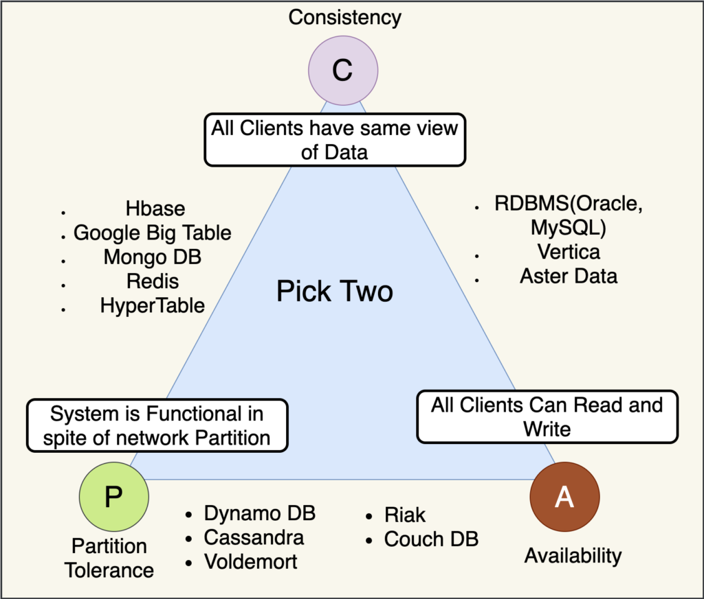

# CAP Theorem / Brewers theorem
      
      C A P - CONSISTENCY, AVAILABILITY, PARTITIONING TOLERANCE

   - [cap-theorem-introduction](http://ksat.me/a-plain-english-introduction-to-cap-theorem)
   - [cap-theorem-video-illustration](https://youtu.be/kwCFHLbIhak?list=PLTCrU9sGyburBw9wNOHebv9SjlE4Elv5a)

- **CAP Theorem**, also known as `Brewer's theorem` (after Eric Brewer, who introduced it), is a fundamental principle in `distributed systems` that states it is **impossible** for a `distributed data store` to simultaneously provide more than two out of the following three guarantees:

   1) **Consistency** - Any read that is happening after a latest write, all the nodes should return the latest value of that write
   2) **Availability**: Every available node in the system should respond in a non error format to any read request without the guarantee of returning the latest write
   3) **Partitioning tolerance** :  System will be responding to all read and write even if the communication channel (or middleware) between nodes is broken (or partitioned)

   
   **<i>"Copyright: Image belongs to [respective-owner](  https://www.nitendratech.com/database/cap-theorem/). Used here with permission or under fair use."</i>** 

### Implications of CAP Theorem

Given the constraints of the CAP theorem, distributed systems must make trade-offs between these three guarantees. Here's a brief look at the implications:

- **CP (Consistency and Partition Tolerance)**: Systems that prioritize **consistency and partition** tolerance may sacrifice **Availability**. During network partitions, these systems might reject some requests to maintain consistent data.
  - Examples: HBase, MongoDB (in some configurations).

- **CA (Consistency and Availability)**: Systems that prioritize **consistency and availability** may sacrifice **partition tolerance**. These systems ensure that every request receives a response and that data is consistent, but they cannot tolerate network partitions well.
  - Examples: Some relational databases in a non-distributed setup.

- **AP (Availability and Partition Tolerance)**: Systems that prioritize **availability and partition** tolerance may sacrifice consistency. During network partitions, these systems may serve stale data to ensure availability.
  - Examples: Cassandra, DynamoDB, Couchbase.

### Real-world Considerations

In practice, network partitions are a fact of life in distributed systems, so most real-world systems choose to be either CP or AP rather than CA. This choice depends on the specific requirements and trade-offs acceptable for the application:

- **If data consistency is crucial** (e.g., banking systems, order processing), then a CP approach may be appropriate.
- **If availability is more critical** (e.g., social media feeds, online gaming), then an AP approach might be chosen.

### Summary

The CAP Theorem is a key principle for understanding the limitations and trade-offs in designing distributed systems. It highlights the need to balance consistency, availability, and partition tolerance according to the specific needs of the application.

  eventual consistency

  ## Tweaking partition tolerance
  1) multiple backup network