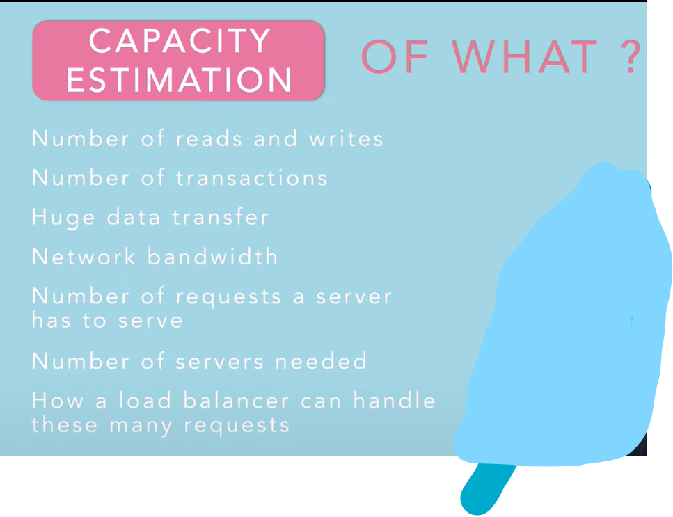

#

Assuming you have been asked a question like , design uber or twitter then:

- first understand the
    1)  functional Requirements. - functionalities provided by the system to fulfill user requirements
    2)  Non-functional requirements - 

- Now after having all the functional requirements of the system, then the functional requirements should translate to the system components. That is, the outcome of functional requirements will inform:
        
    1) The system design diagram
    2) Component and Architecture diagram 

- outcome of the non-functional requirements should help you make the choice of resources and number of resources to use through capacity estimation. They will also inform:
    1) Tech choices
    2)  Resource Utilization
    3) Data storages
    4) servers or hardwares
    5) etc
 
 Example: Design uber or twitter:

 Understanding both the functional and non-functional requirements is essential for designing a complex system like Uber or Twitter. Here's a step-by-step approach based on your outline:

1. **Understand Functional Requirements**:
   - For Uber: Functional requirements might include user registration, booking a ride, driver availability, real-time tracking, payment processing, and feedback/rating system.
   - For Twitter: Functional requirements might include user registration, posting tweets, following other users, timeline generation, notifications, direct messaging, search functionality, and analytics.

2. **Understand Non-functional Requirements**:
   - These could include scalability (handling increasing numbers of users and data), availability (minimizing downtime), performance (quick response times), security (protecting user data), and reliability (consistent performance).
   - For Uber, non-functional requirements might include real-time tracking accuracy, low latency in matching drivers and riders, and secure payment processing.
   - For Twitter, non-functional requirements might include high availability of tweets, low latency in loading timelines, and secure authentication and authorization.

3. **Translate Functional Requirements to System Components**:
   - Create system design diagrams illustrating the components of the system and how they interact with each other. For Uber, this might involve components for user authentication, ride booking, driver matching, payment processing, etc. For Twitter, it might involve components for user authentication, tweet storage, timeline generation, messaging, etc.

4. **Make Tech Choices and Resource Utilization Decisions**:
   - Based on the non-functional requirements and capacity estimation, decide on the appropriate technologies and resources to use. This might involve choices related to programming languages, frameworks, databases, cloud services, and hardware.
   - For example, Uber might use real-time databases and microservices architecture for scalability, while Twitter might use distributed databases and caching systems for high availability.

5. **Design Data Storage and Server Infrastructure**:
   - Decide on the data storage solutions (relational databases, NoSQL databases, caching systems) based on the requirements for data consistency, scalability, and performance.
   - Determine the number and configuration of servers or cloud instances needed to handle the expected load, considering factors like traffic patterns, geographic distribution of users, and peak usage times.

# Capacity Estimation
https://youtu.be/VBw703pjC3E?list=PLTCrU9sGyburBw9wNOHebv9SjlE4Elv5a

